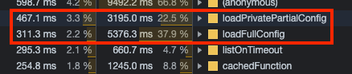

# Babel config overhead

Steps to reproduce:

1. Clone repo
2. Run `npm install`
3. Run `node src/profile.js`
4. Import generated `profile.cpuprofile` into the "Performance" tab of Chrome DevTools

Looks like this on my machine:

